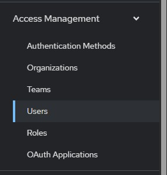
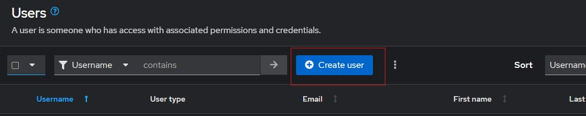
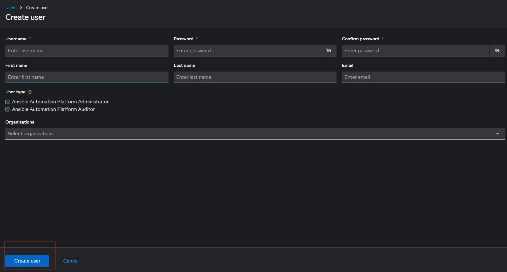
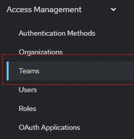
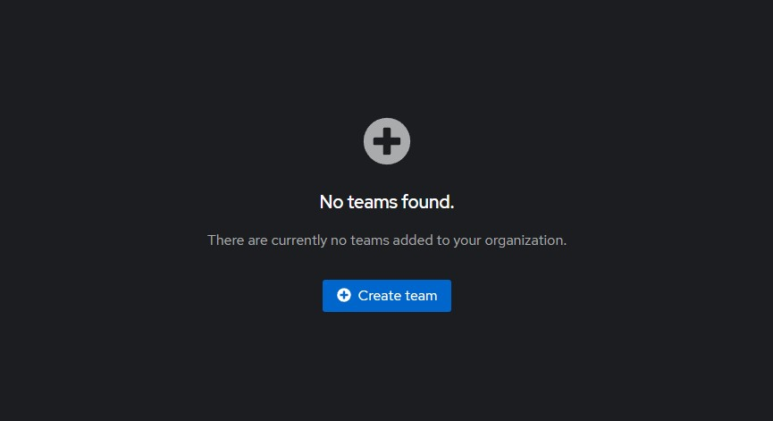
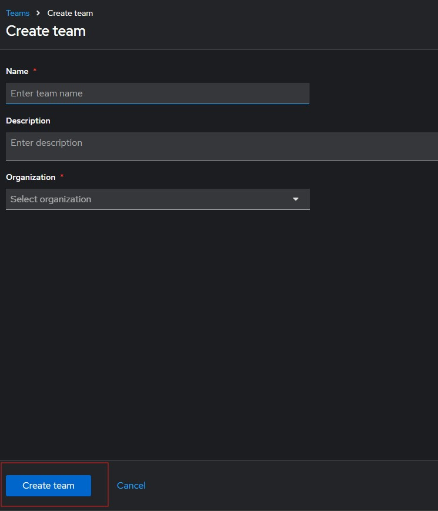

#### Creating a user

On ansible automation platform webpage, user creation can be found under `Access Management` as shown in the image below.

Click on `Create user` to create a new user. 

Fill out the form for the new user, and click on `Create User` button below the form. 

#### Creating a team

Select team from the access management tab. 

Click on `Create Team`

Fill out the form and click `Create team` button.

Creating organizations, Roles etc follows the same steps as the `user` and `team` creation. 