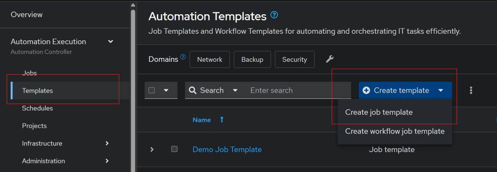
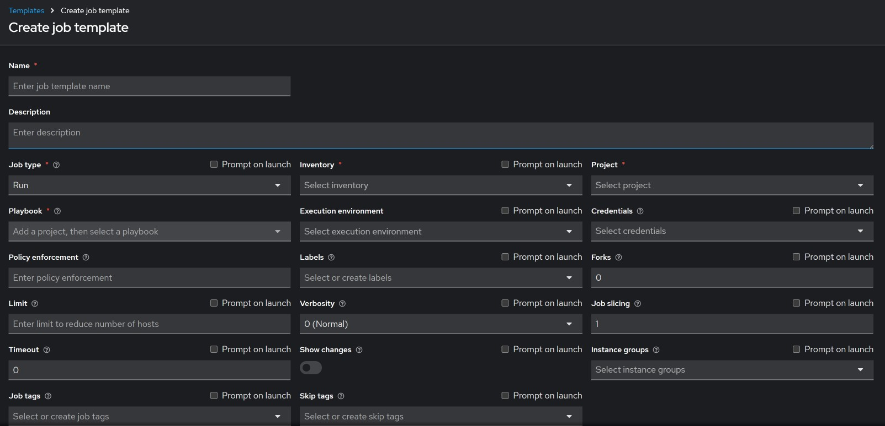
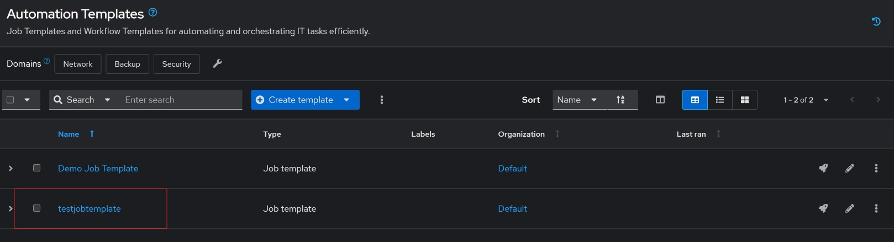
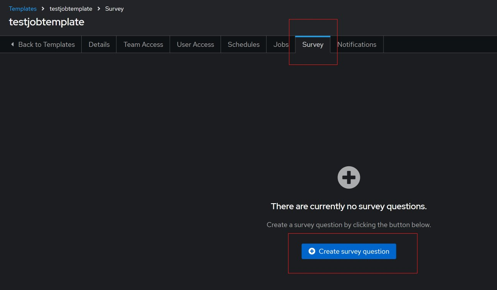
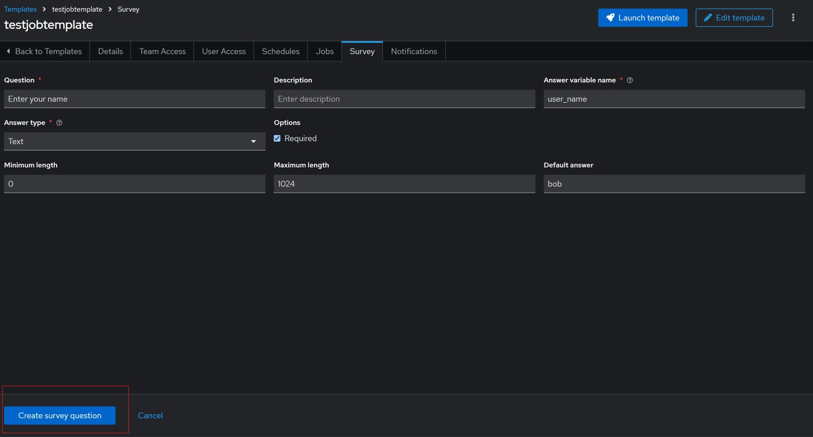
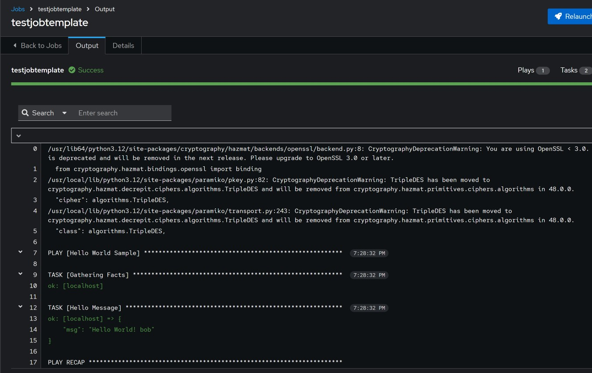

#### Creating Job template surveys

User input can be collected while running ansible via the CLI by using `vars_prompt`. However, this isn't supported on ansible automation platform. The alternative is to use `Job Template surveys`. The survey will prompt for variables when the job is started. 

There are different answer types for the variables in the survey;
- `Text`: single line of text
- `TextArea`: text of multiple lines
- `Password`: treated as sensitive information
- `Multiple choice (single select)`: list of options, were one item can be selected. 
- `Multiple choice (multiple select)`: list of options, were multiple items can be selected.
- `Integer`: an integer number
- `Float`: a floating point number

How to create a template from the web GUI;

Under `Automation Execution` select `Templates`, click on `Create template` and select `Create job template`.



Fill out the required fields as shown below;



After creating the job template, you can add a survery by going back to select the template as shown below



Click on the `Survey` tab and click on `Create survey question`.



Fill out the required information and click `Create survey question`.



This can then be utilized with the sample playbook, this playbook comes with the installation of ansible automation platform, however I edited it to use the `user_name` variable I created in the template survey.

Location of the playbook;

```shell
/home/ansible/aap/controller/data/projects/_6__demo_project
[ansible@tower _6__demo_project]$ ls
hello_world.yml  README.md
```
Edited playbook;

```yaml
- name: Hello World Sample
  hosts: all
  tasks:
    - name: Hello Message
      debug:
        msg: "Hello World! {{ user_name }}"

```
Output of the playbook after running it, and putting in the default value when prompted.



