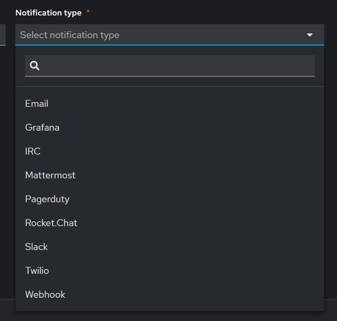
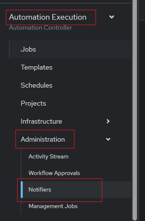
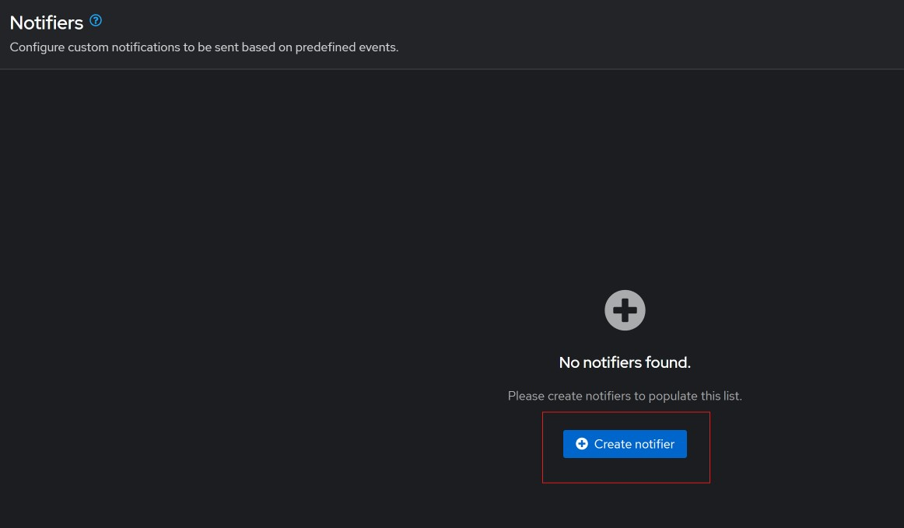
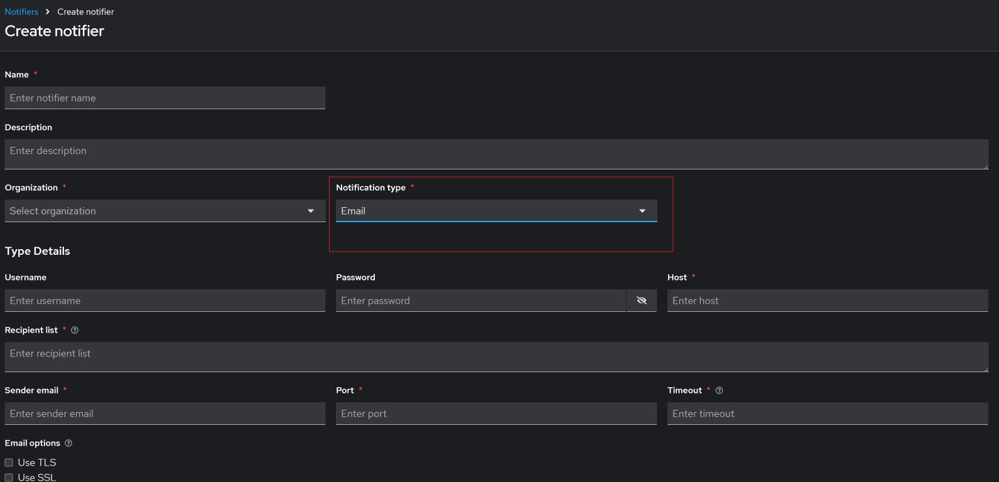
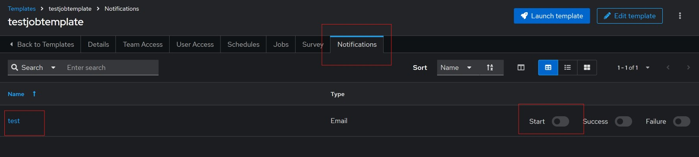

#### Configuring notifications

We can configure ansible automation platform to send notifications for jobs, see below the available types of noftifications. 

To configure a notification, we go to `Automation Execution` &rarr; `Administration` &rarr; `Notifiers`.

Click on `Create notifier`

Select the notification type, and fill out the form accordingly. For email notifications, you will need a mail server configured so that the ansible automation platform can send the email. Finally click on `Save notifier` to save the notification.

To use the newly created notification, go back to templates, select the template you want to use, then go to the notification tab, you will see the notifications you have created. Select start to enable that notification for that template.

