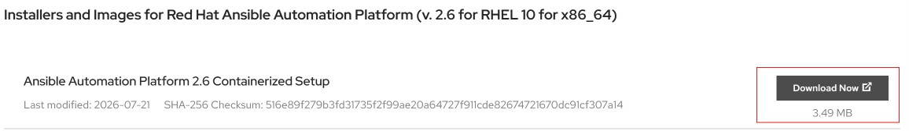

#### Installing Ansible Automation Platform.
I tried to follow the guide in Sander van Vugt's training for installing Ansible Tower, but that guide is outdated because you will be running newer versions of ansible and python. 
To use that guide, you will need to make sure your environment is fully isolated and you are using older versions of ansible, python etc. The recommendation is to use the official guide from Red Hat to install the version of Ansible Automation Platform (AAP) on your chosen RHEL distribution. I followed this [guide](https://docs.redhat.com/en/documentation/red_hat_ansible_automation_platform/2.6/install-proc_installing_containerized_aap)  to install AAP 2.6 on RHEL10.2 (registered with `subscription-manager`)

Note AAP doesn't need to be installed on the control node, it can be a standalone installation on another server in your network. 

Basic installation overview below:
1. Register for a [Redhat Developer Account](https://developers.redhat.com/). 
2. You will need a [Registry Service Account](https://access.redhat.com/terms-based-registry/accounts), create one and save the username and password. 
3. You will need to download your version of [AAP](https://access.redhat.com/downloads/content/480/ver=2.6/rhel---10/2.6/x86_64/product-software), and move it to the server you will be installing it from. I downloaded the   version since I have access to the internet and can pull the images during installation.
4. Move the downloaded tarball file to `/tmp` directory. 
5. Create a user that you will be using; I created an `admin` user. Make sure the user has passwordless sudo access, use a sudoers.d dropping in file here. 
6. Copy the tarball file to the home directory of the `admin` user, and extract it.
7. Content of the tarball;
```shell
total 92
-rw-r--r--. 1 admin admin   146 Jul  8 16:24 ansible.cfg
drwxr-xr-x. 3 admin admin    33 Jul  8 16:23 collections
-rw-r--r--. 1 admin admin  4422 Jul  8 16:24 inventory
-rw-r--r--. 1 admin admin  4172 Jul  8 16:24 inventory-growth
-rw-r--r--. 1 admin admin 71853 Jul  8 16:24 README.md
```
8. copy the inventory-growth to the inventory file, `cp inventory-growth inventory`
9. Use string replacement in vim to update `<set your own>` to a password you will remember. 
10. Also, update the registry variables below with the values from step 2 above. 
```yaml
registry_username=<your RHN username>
registry_password=<your RHN password>
```
11. Install `ansible-core` on host if ansible wasn't installed initially. `sudo dnf install ansible-core` 
12. Once the inventory file as been updated, run `ansible-playbook -i inventory ansible.containerized_installer.install` Note, if you have less than 16GB of memory space, this will fail, overwrite the memory check with: `ansible-playbook -i inventory ansible.containerized_installer.install -e '{"ansible_memtotal_mb": 16000}'` Basically, we are overwriting the `ansible_memtotal_mb` fact on the command line with a value we want. 