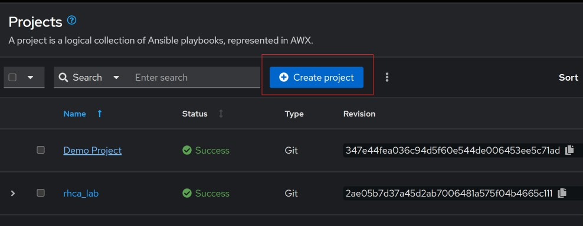
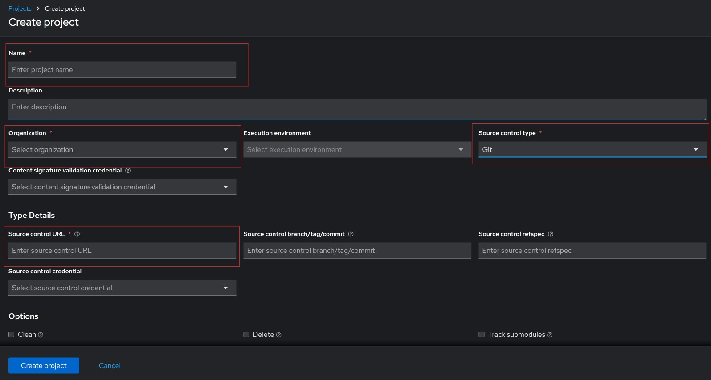
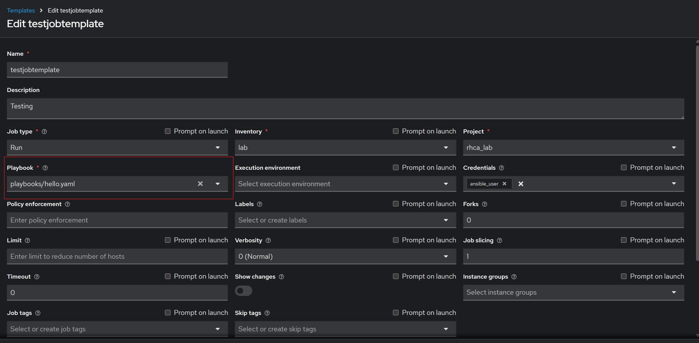
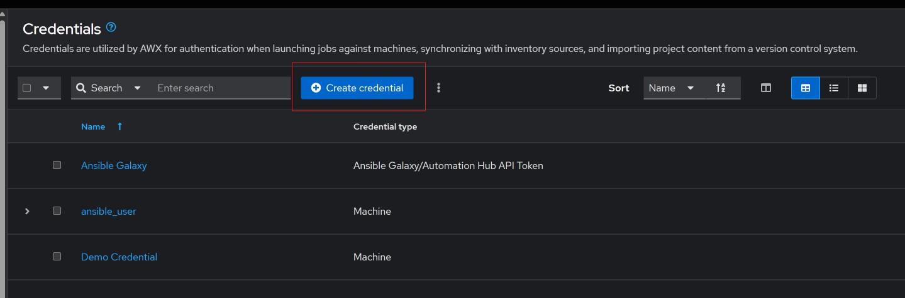
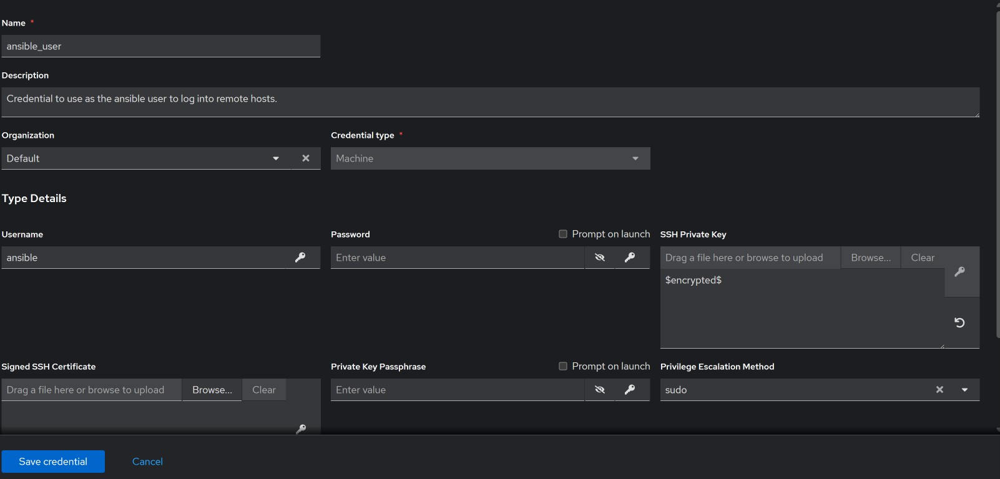
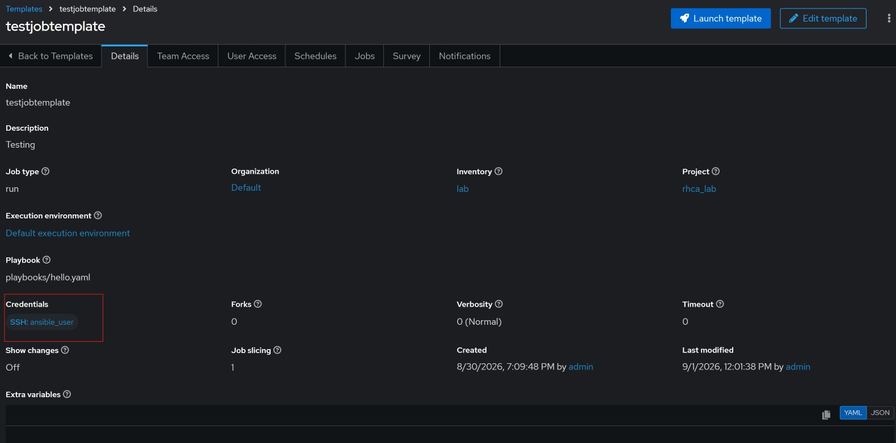

#### Configuring my Ansible Automation Platform (AAP) to run from my github

These are the steps I used to get my AAP to utilize playbooks stored in my git repository.

- Created a directory in my existing repository to hold my playbooks. 
- On AAP web gui, go to `Automation Execution`  &rarr; `Projects` and click on `Create project` button.

- Fill out the form that shows up, select `Git` as the `Source control Type`, and paste the `url` of the git repository into the `Source control URL` link. Then click on `Create project`

To use the above created project, head back to job template you want to use, and edit it to use the project. While editing this, you can pick the playbook you want from the `Playbook` dropdown as shown below;

#### Configuring ssh access from AAP to managed nodes.

Similar to how we configured ssh keys on a control node, AAP also requires passwordless ssh connectivity to the managed hosts. We start by generating a private/public ssh keys as performed in the control node setup, the copy the keys over to the managed node. On AAP web gui, go to `Automation Execution`  &rarr; `Infrastructure`  &rarr; `Credentials` then click on `Create credential` as shown below.

Fill out the credential form, the `Credential Type` has to be set to `Machine`, then you will need to paste the private key created above into the `SSH Private Key` box, note once you save, this will be encrypted, and you can't view it again.

To use this new credential, go back to template and make sure the job template is making use of the newly created credential as shown below.

