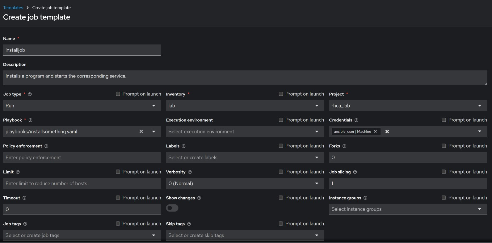
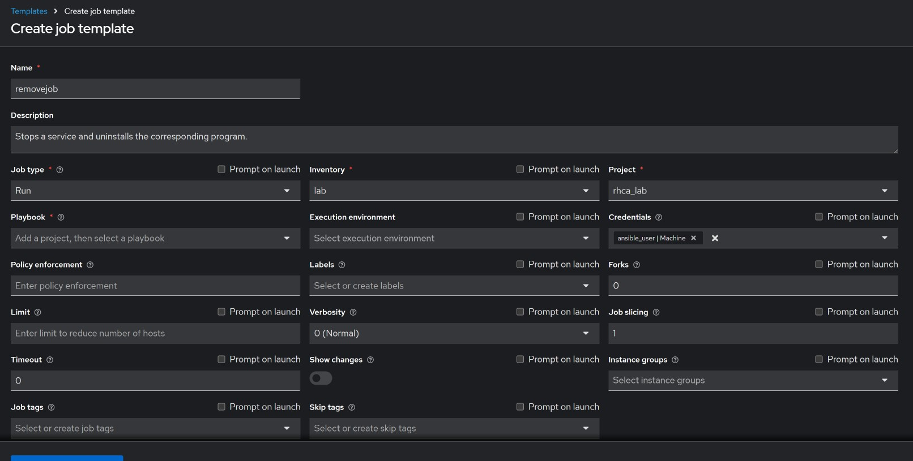
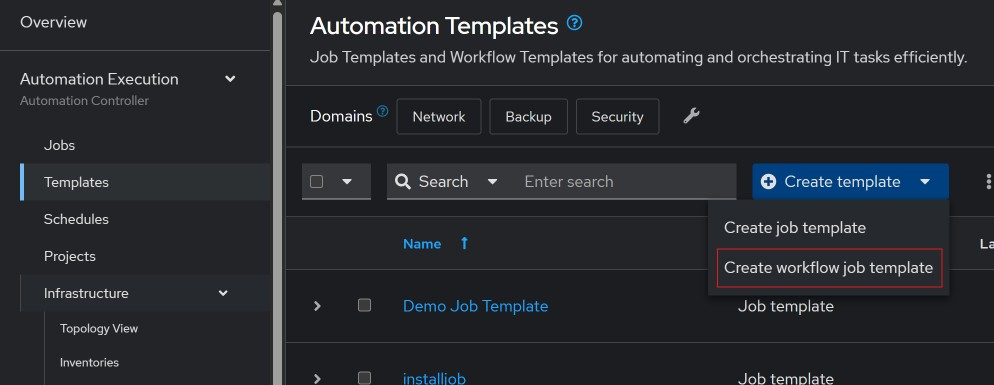
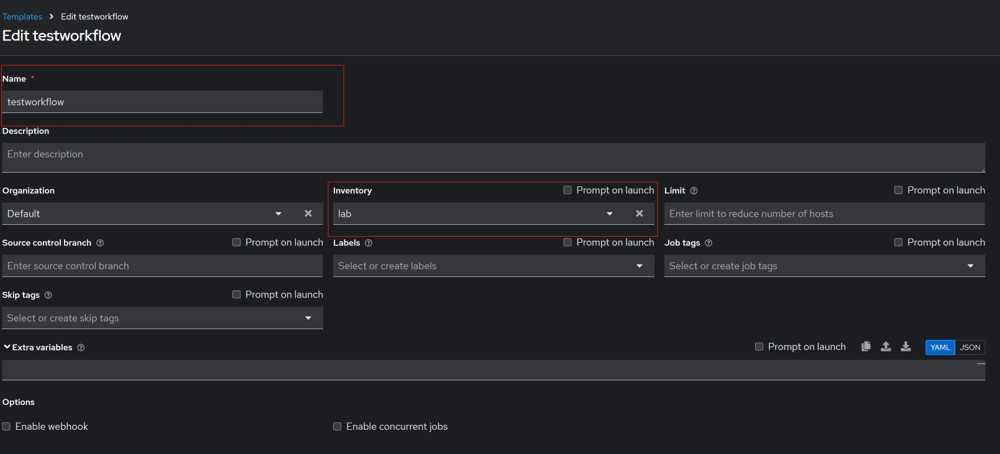
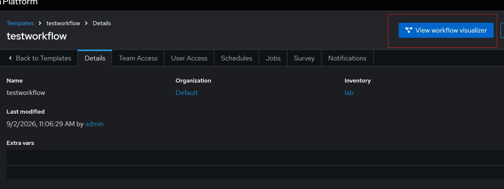
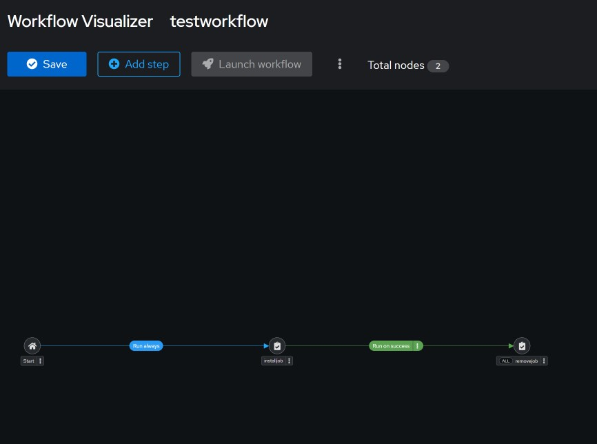

#### Example of workflow template.

First we need to create two job templates, first one will be `installjob`, second one will be `removejob`. 

After creating the two job templates, we will create the workflow template. 

Under `Automation Execution`, select `Templates` then click on `Create template` and select `Create workflow job template`.

Fill out the form as shown below;

After creating th workflow template, go back to templates, select the workflow template and click on `View workflow visualizer`.

Click on `Add step` button.

I added the `installjob` template, and the `removejob` template will only run when the `installjob` succeeds. 

