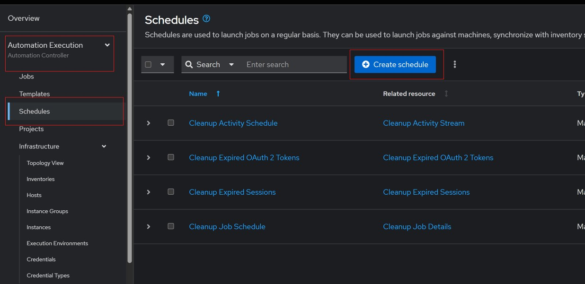
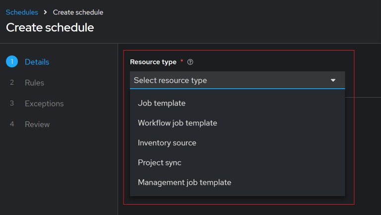
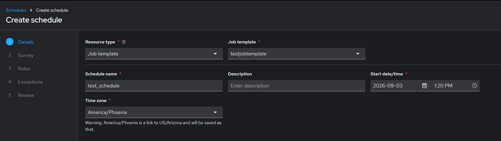
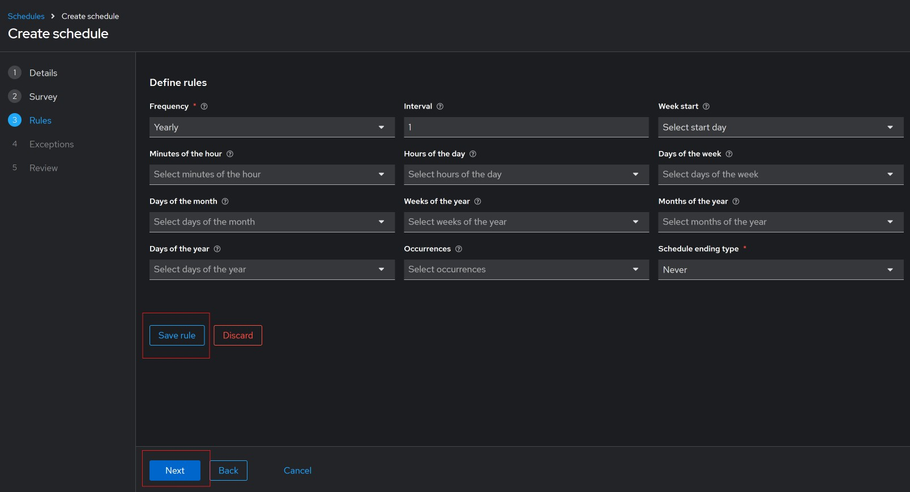
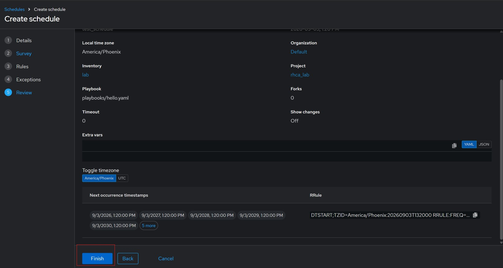

#### Scheduling jobs.

Jobs and workflow templates can be scheduled to run at certain cadence. 
To accomplish this, go to `Automation Execution` click on `Schedules` then on `Create schedule` button. 

Pick the resource type, for this example we will go with `Job template`.

Fill out the form and click on next. 

Go to `Rules` and enter how you want the schedule to behave. 

Save the rules and click on next. 

You can add an exception, but skipping that for this test. 

Review the schedule then click finish to save it, address any errors that pop up.

