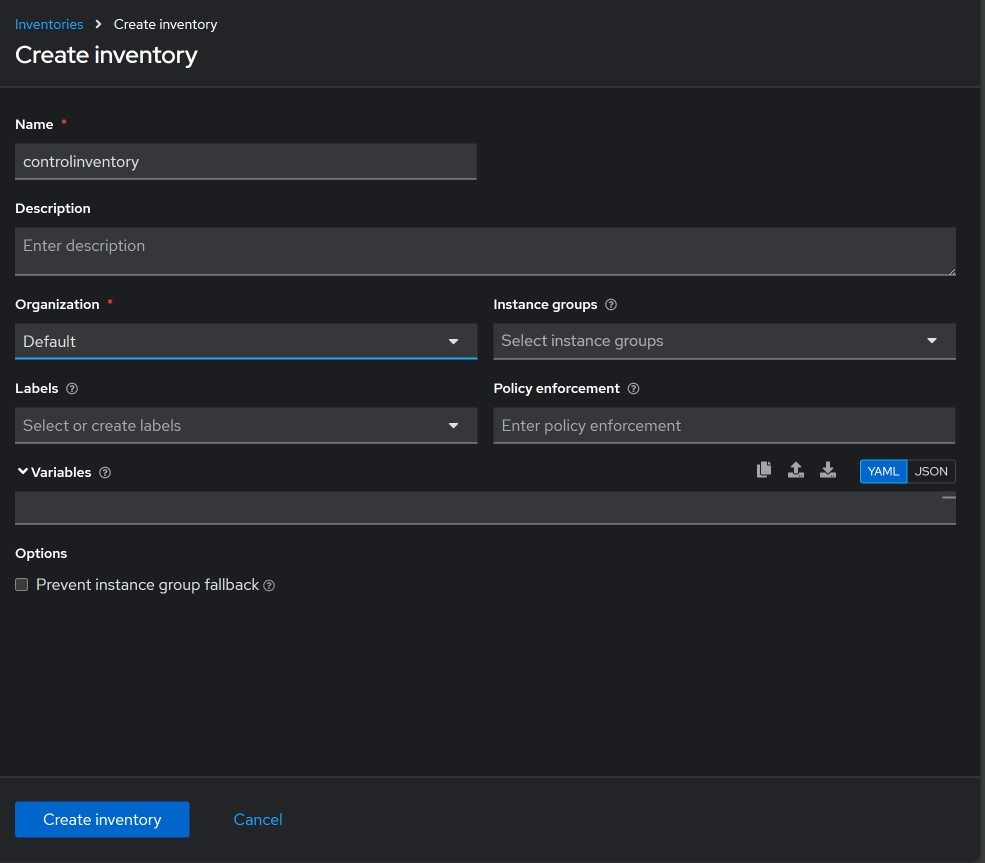
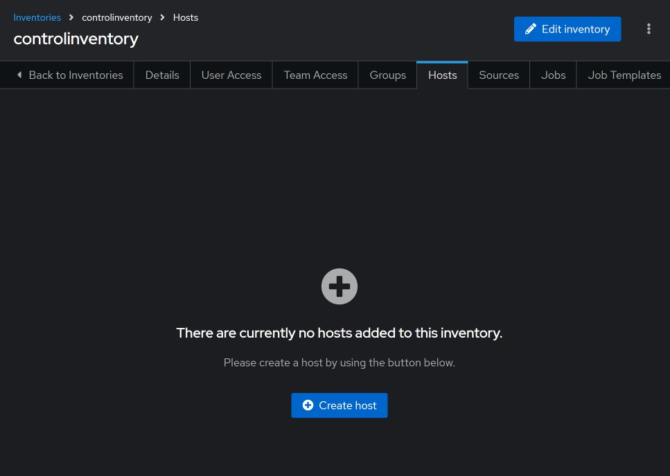
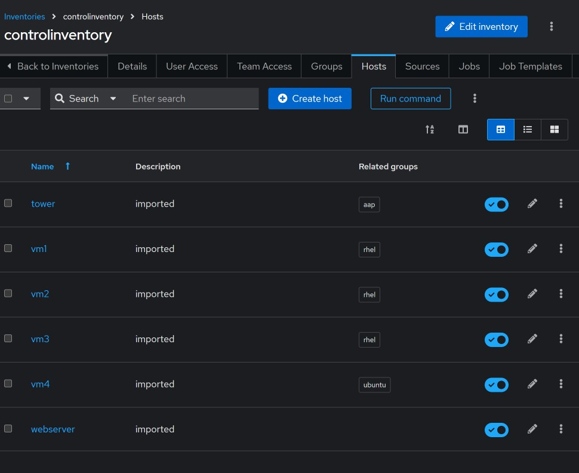

#### Scheduling jobs.

Jobs and workflow templates can be scheduled to run at certain cadence. 
To accomplish this, go to `Automation Execution` click on `Schedules` then on `Create schedule` button. 


Pick the resource type, for this example we will go with `Job template`.


Fill out the form and click on next. 


Go to `Rules` and enter how you want the schedule to behave. 


Save the rules and click on next. 

You can add an exception, but skipping that for this test. 

Review the schedule then click finish to save it, address any errors that pop up.


#### Importing Static Inventory to AAP.

The first step is to create the inventory name `controlinventory` in AAP, see image below.



Move the inventory file to a directory that is readable to all users. 

```shell
cp ~/inventory /tmp/inventory
chmod 644 /tmp/inventory
```


Use `awx-manage` cli utility to do the import. 

`podman exec -it automation-controller-task awx-manage inventory_import --source=/tmp/inventory --inventory-name="controlinventory" --overwrite`


Before importing:



After importing:




