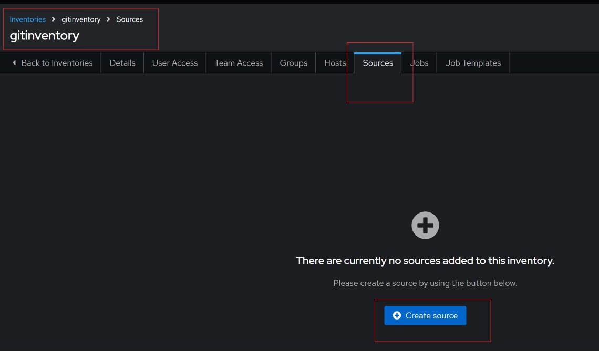
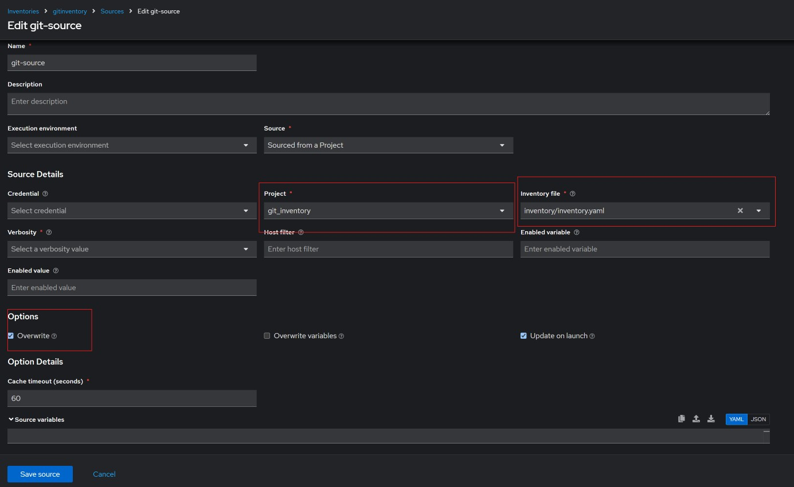
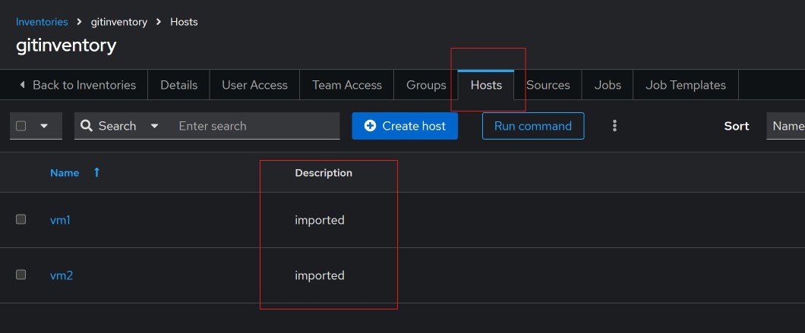

#### Importing inventory file from Git.

I created a sample [inventory file](../inventory/inventory.yaml) and uploaded it to github. To use this, will create a test inventory `gitinventory` on AAP. Then go to the inventory and select `Sources` then click on `Create source`. 

Shown below is the filled out source, note I created another project that points to this repository. 

After saving the source, we can verify that the hosts were imported by going to the `Hosts` tab as shown below.

