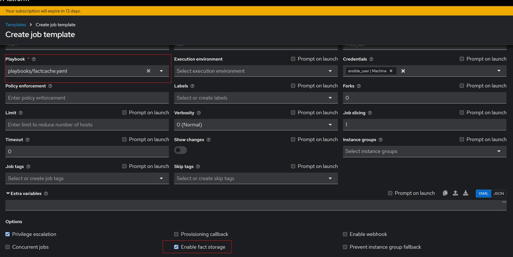
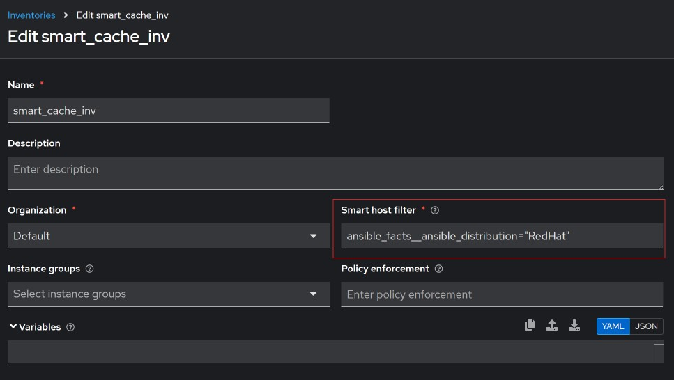
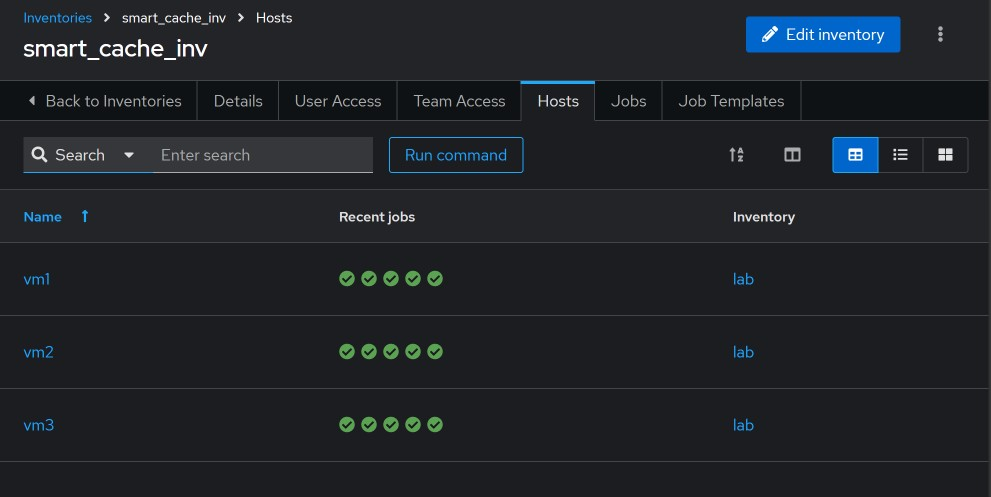
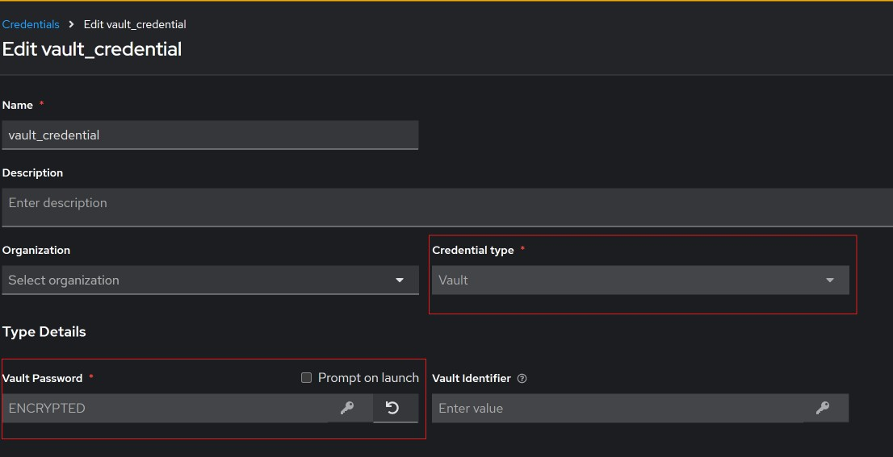
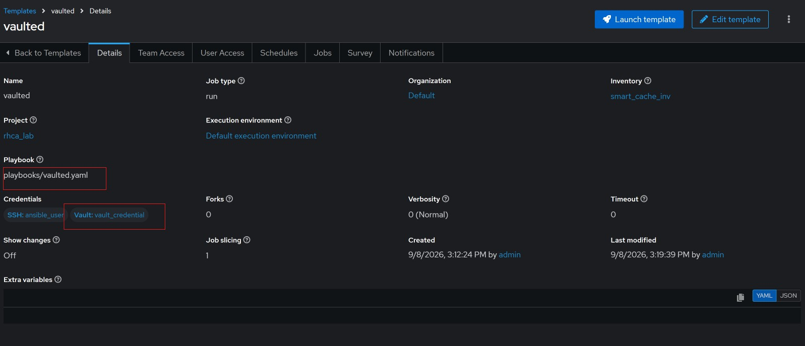

#### Importing inventory file from Git.

I created a sample [inventory file](../inventory/inventory.yaml) and uploaded it to github. To use this, will create a test inventory `gitinventory` on AAP. Then go to the inventory and select `Sources` then click on `Create source`. 

Shown below is the filled out source, note I created another project that points to this repository. 

After saving the source, we can verify that the hosts were imported by going to the `Hosts` tab as shown below.

#### Dynamic Smart Inventory

Smart inventory is dynamically created from other inventory sources by using a filter. These filters are from the `ansible_facts` discovered from the hosts. Fact cache is used, hence a job template with the `Enable fact storage` option needs to be setup and ran periodically. See the job template created below, the [playbook](../playbooks/factcache.yaml) runs a simple fact gathering play, and AAP stores the values.

After running the job template created (or having it run on a schedule), we can go ahead and create a smart inventory as shown below. Note, in the `Smart host filter` box, the fact needs `__` instead of `_` to traverse the `json`, so we have; `ansible_facts__ansible_distribution="RedHat"`

This will automatically grab only the hosts that are `RedHat` distribution. 

#### Using Vault in AAP.

I created a [playbook](../playbooks/vaulted.yaml) that is currently encrypted with a vault password. To decrypt and run the playbook, I will need to first created a vault credential that has the password, then I can use that credential in a job template to run the playbook.

