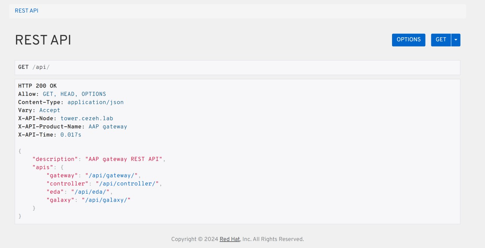

#### Understanding Ansible Automation Platform API contd.

AAP provides that graphical website to explore the API, go to `https://<towerhostname>/api` and you will get a website as shown below where you can interact with the API. 



Also, you can make the output of the API more readable by either using `jq` or `json_pp`. 

```shell
[ansible@control ansible_work]$ curl -X GET https://tower.cezeh.lab/api/ -k | json_pp
  % Total    % Received % Xferd  Average Speed   Time    Time     Time  Current
                                 Dload  Upload   Total   Spent    Left  Speed
  0     0    0     0    0     0      0      0 --:--:-- --:--:-- --:--:--     0Duplicate specification "V" for option "v"
100   147  100   147    0     0   4771      0 --:--:-- --:--:-- --:--:--  4900
{
   "apis" : {
      "controller" : "/api/controller/",
      "eda" : "/api/eda/",
      "galaxy" : "/api/galaxy/",
      "gateway" : "/api/gateway/"
   },
   "description" : "AAP gateway REST API"
}
```
