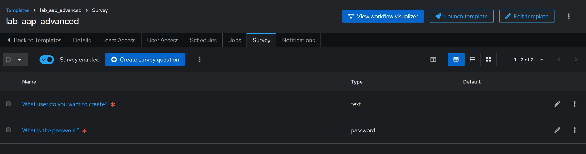
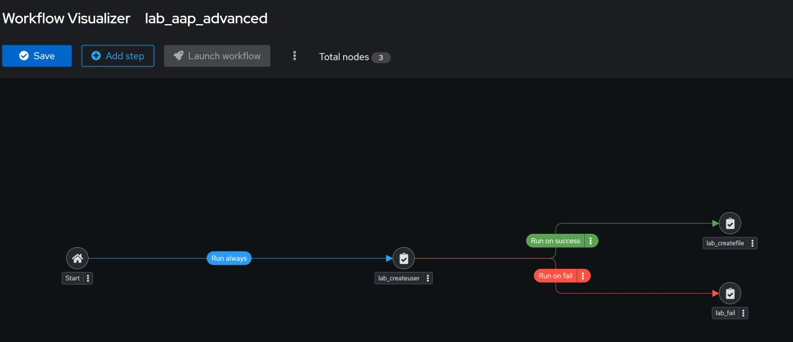
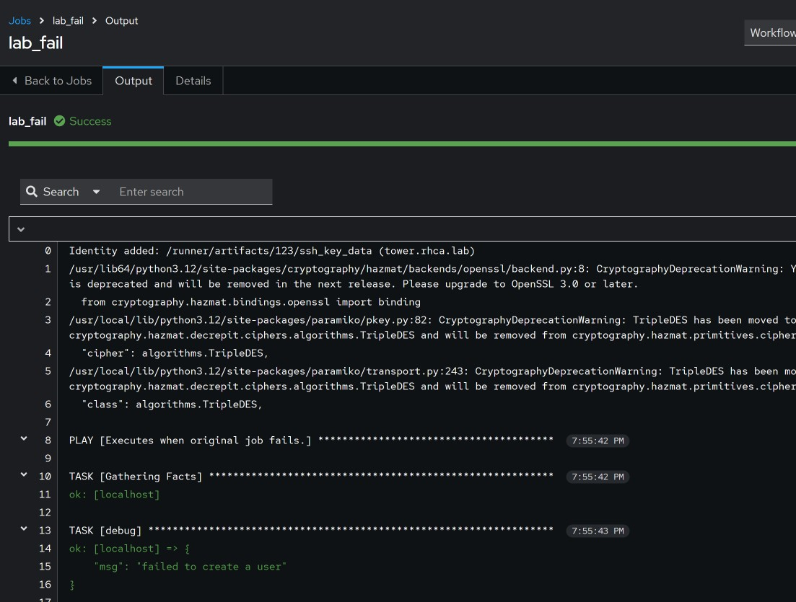
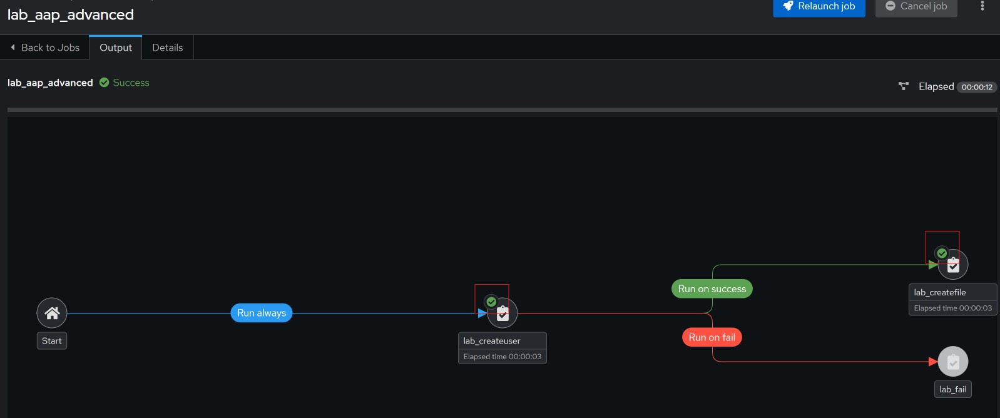

#### Lab for advanced AAP

##### Question:

Create a `Job Template Worklow` that meets the following requirements:
- The primary job to be used creates a user with a password.
- Configure a variables prompt, where the user needs to input username as well as password.
- It is allowed but not required to use a properly encrypted password
- If the job executes successfully, another job should run that creates the directory `/${USER}files` and sets the user you created as owner to that directory
- If the job fails to execute, a dedicated job should run that prints the message `"failed to create a user"`.

##### Solution:
We need 3 playbooks, the simplest to create is the [error message playbook](../playbooks/lab_fail.yaml).

The next playbook is the one that [creates the file](../playbooks/lab_createfile.yaml), since we are using `Job Template workflow` We don't need to do any error checking, this will be handled by workflow, since this playbook will on run when the user has been created. We will use a prompt in the workflow that assigns the same `user_name` variable. 

Finally, we create the [playbook](../playbooks/lab_createuser.yaml) that creates the user.

We will create a `job template` for the 3 plays, then link them together in the `Job Template Worklow`.

Create the workflow with 2 required survey questions as shown below.

Created the workflow vizualizer as shown below.

To test the fail, I will change the create_user playbook to trigger a failure immediately.

Lab fail worked.

Lab pass worked too. 

Lab completed!