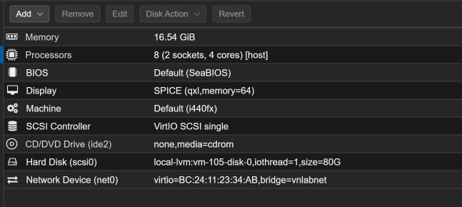
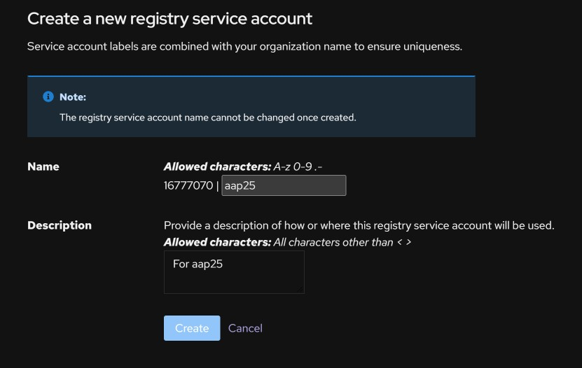
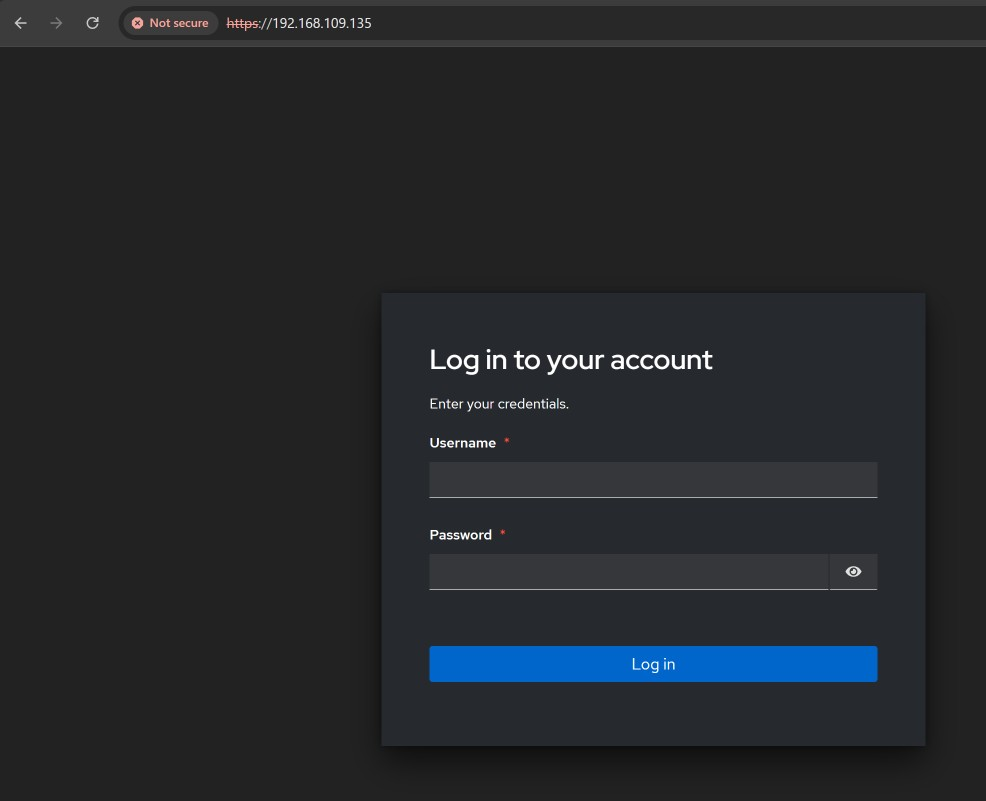

#### Installing Ansible Automation Platform 2.5

I already have ansible automation platform 2.5 running, but didn't document the installation process. 

We will be following this [guide](https://docs.redhat.com/en/documentation/red_hat_ansible_automation_platform/2.5) provided by RedHat for the installation of AAP 2.5. This will be installed on a RHEL9 machine, with the following specs.



We will be using the [containerized installation](https://docs.redhat.com/en/documentation/red_hat_ansible_automation_platform/2.5/html/containerized_installation/index), the RPM installation has been deprecated. Hence, we will need a [Registry Service Account](https://access.redhat.com/terms-based-registry/accounts), create one and save the username and password. This will be used during the installation to update the following variables (`registry_username=<your RHN username>
registry_password=<your RHN password>`) in the inventory file. See picture below;



Next step is to download the [containerized image](https://access.redhat.com/downloads/content/480/ver=2.5/rhel---9/2.5/x86_64/product-software) for AAP. I downloaded on my local machine, and used scp to move it to the VM. 

Use tar to extract the tarball. `tar -xvf ansible-automation-platform-containerized-setup-2.5-25.tar.gz`


Copy the inventory-growth to the inventory file, `cp inventory-growth inventory`
Use string replacement (`%s/<set your own>/memorable password/g`) in vim to update `<set your own>` to a password you will remember. 
Also, update the registry variables below with the values from step 2 above. 
```yaml
registry_username=<your RHN username>
registry_password=<your RHN password>
```
Install `ansible-core` on host if ansible wasn't installed initially. 
`sudo subscription-manager repos --enable=ansible-automation-platform-2.5-for-rhel-9-x86_64-rpms`
`sudo dnf install ansible-core` 
Once the inventory file as been updated, run `ansible-playbook -i inventory ansible.containerized_installer.install` Note, if you have less than 16GB of memory space, this will fail, overwrite the memory check with: `ansible-playbook -i inventory ansible.containerized_installer.install -e '{"ansible_memtotal_mb": 16000}'` Basically, we are overwriting the `ansible_memtotal_mb` fact on the command line with a value we want. Also, since we are pulling the images required for AAP, this installation will take sometime depending on the speed of your network.


I got the error below, this was because I didn't have name resolution in my lab, so I added the hostname of the vm to `/etc/hosts` file to rectify.

```shell
TASK [ansible.containerized_installer.automationgateway : Ensure automation gateway proxy is ready] *************************************************************************
FAILED - RETRYING: [aap25.cezeh.lab]: Ensure automation gateway proxy is ready (30 retries left).
FAILED - RETRYING: [aap25.cezeh.lab]: Ensure automation gateway proxy is ready (29 retries left).
FAILED - RETRYING: [aap25.cezeh.lab]: Ensure automation gateway proxy is ready (28 retries left).
FAILED - RETRYING: [aap25.cezeh.lab]: Ensure automation gateway proxy is ready (27 retries left).
FAILED - RETRYING: [aap25.cezeh.lab]: Ensure automation gateway proxy is ready (26 retries left).
FAILED - RETRYING: [aap25.cezeh.lab]: Ensure automation gateway proxy is ready (25 retries left).
FAILED - RETRYING: [aap25.cezeh.lab]: Ensure automation gateway proxy is ready (24 retries left).
FAILED - RETRYING: [aap25.cezeh.lab]: Ensure automation gateway proxy is ready (23 retries left).
FAILED - RETRYING: [aap25.cezeh.lab]: Ensure automation gateway proxy is ready (22 retries left).
FAILED - RETRYING: [aap25.cezeh.lab]: Ensure automation gateway proxy is ready (21 retries left).
FAILED - RETRYING: [aap25.cezeh.lab]: Ensure automation gateway proxy is ready (20 retries left).
FAILED - RETRYING: [aap25.cezeh.lab]: Ensure automation gateway proxy is ready (19 retries left).
FAILED - RETRYING: [aap25.cezeh.lab]: Ensure automation gateway proxy is ready (18 retries left).
FAILED - RETRYING: [aap25.cezeh.lab]: Ensure automation gateway proxy is ready (17 retries left).
FAILED - RETRYING: [aap25.cezeh.lab]: Ensure automation gateway proxy is ready (16 retries left).
FAILED - RETRYING: [aap25.cezeh.lab]: Ensure automation gateway proxy is ready (15 retries left).
FAILED - RETRYING: [aap25.cezeh.lab]: Ensure automation gateway proxy is ready (14 retries left).
FAILED - RETRYING: [aap25.cezeh.lab]: Ensure automation gateway proxy is ready (13 retries left).
FAILED - RETRYING: [aap25.cezeh.lab]: Ensure automation gateway proxy is ready (12 retries left).
FAILED - RETRYING: [aap25.cezeh.lab]: Ensure automation gateway proxy is ready (11 retries left).
FAILED - RETRYING: [aap25.cezeh.lab]: Ensure automation gateway proxy is ready (10 retries left).
FAILED - RETRYING: [aap25.cezeh.lab]: Ensure automation gateway proxy is ready (9 retries left).
FAILED - RETRYING: [aap25.cezeh.lab]: Ensure automation gateway proxy is ready (8 retries left).
FAILED - RETRYING: [aap25.cezeh.lab]: Ensure automation gateway proxy is ready (7 retries left).
FAILED - RETRYING: [aap25.cezeh.lab]: Ensure automation gateway proxy is ready (6 retries left).
FAILED - RETRYING: [aap25.cezeh.lab]: Ensure automation gateway proxy is ready (5 retries left).
FAILED - RETRYING: [aap25.cezeh.lab]: Ensure automation gateway proxy is ready (4 retries left).
FAILED - RETRYING: [aap25.cezeh.lab]: Ensure automation gateway proxy is ready (3 retries left).
FAILED - RETRYING: [aap25.cezeh.lab]: Ensure automation gateway proxy is ready (2 retries left).
FAILED - RETRYING: [aap25.cezeh.lab]: Ensure automation gateway proxy is ready (1 retries left).
fatal: [aap25.cezeh.lab]: FAILED! => {"attempts": 30, "changed": false, "elapsed": 0, "msg": "Status code was -1 and not [200]: Request failed: <urlopen error [Errno 111] Connection refused>", "redirected": false, "status": -1, "url": "https://aap25.cezeh.lab:443"}

```

Once installation is done, you can access the webserver using the ip address of the host that is running AAP. You will be greeted with the page below, use the user you used to install AAP and the password that is in the inventory file.

