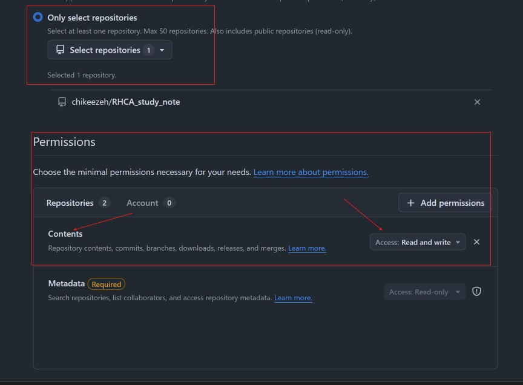
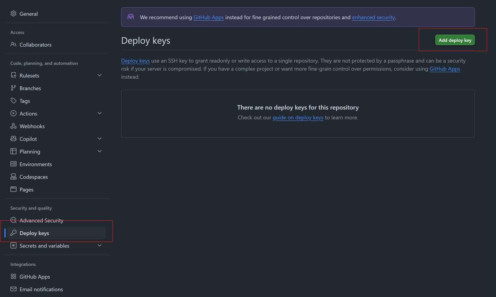

#### Git drills

Practicing the required git skills needed for the exam. 

Created a private git repository on `Github` to practice pushing to a remote repository. 

##### Exam requirements (Understand and use Git).
- Clone a Git repository
- Create, modify and push files in a Git repository

###### Cloning a git repository

Since I am using a private repository on Github, a personal access token is required, make sure to select read/write as part of the contents in permissions, and for repository access, select your private repo as shown in the image below. 

For https cloning, use `git clone <url>`, you will be prompted for username, enter that, then for the password, enter the personal access token you generated above.

For ssh cloning, we will need to add a public ssh key to our repository, go to the repository setting as shown below.

Then click on deploy keys, use the guide to create a key. 

Same as https cloning, use `git clone <ssh url>` to clone the remote repository.
