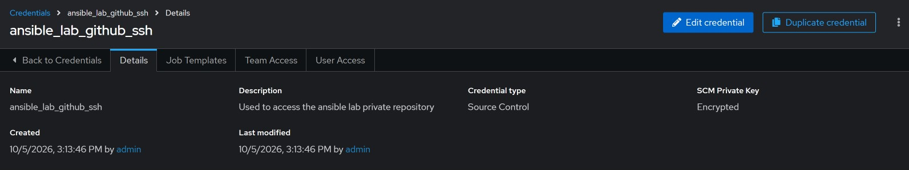
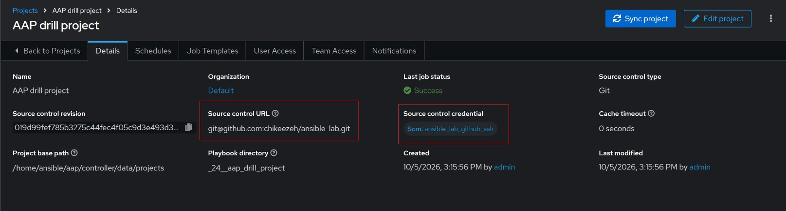
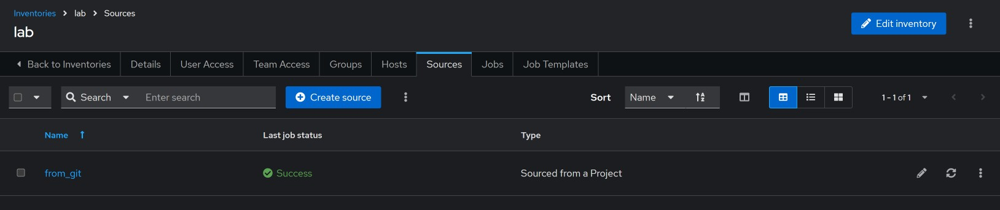
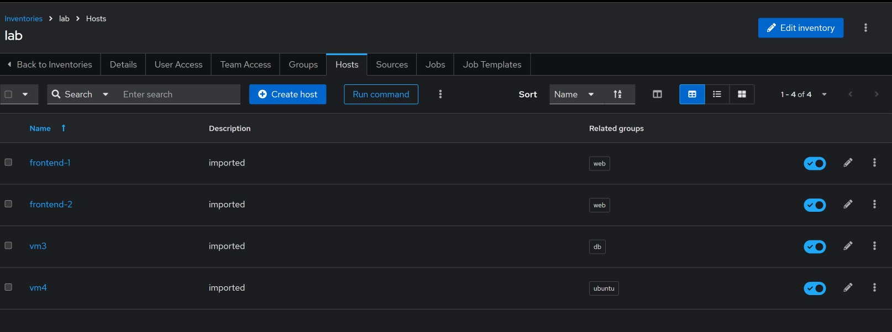
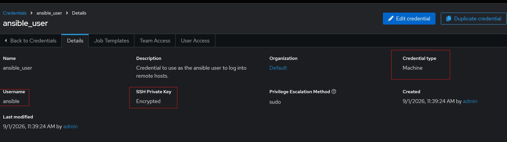

#### Putting the previous drills on Ansible Automation Platform.

Capstone: a tagged multi-role playbook launched through automation controller (project → inventory → credentials → job template). This will be broken down into separate tasks. 

###### Task 1 — push the code. 

Push your tagged playbook (site.yml) to the private GitHub repo, top level of the repo. Tell me the playbook's path in the repo once it's up.

<details>
<summary> Click to open solution </summary>

First step is to move all the files created in the previous drills to the repo directory.

```shell
[ansible@tower drill2]$ cp -r ./* /home/ansible/dev/ansible-lab/
[ansible@tower drill2]$ tree /home/ansible/dev/ansible-lab/
/home/ansible/dev/ansible-lab/
├── anotherfeature
├── config.txt
├── deploy.yml
├── featurefile
├── firstfile
├── group_vars
│   ├── all
│   │   ├── common.yml
│   │   └── security.yml
│   ├── db
│   │   └── config.yml
│   └── web
│       ├── config.yml
│       └── packages.yml
├── host_vars
│   ├── frontend-1
│   │   ├── app.yml
│   │   └── tuning.yml
│   ├── frontend-2
│   │   └── tuning.yml
│   ├── vm3
│   │   └── tuning.yml
│   └── vm4
│       └── app.yml
├── inventory
├── README.md
├── remotefile
├── secondfile
├── site.yml
├── task2.yml
└── testgroupvars.yml

9 directories, 22 files

```
Remove some of the files not needed for this project. 

```shell
[ansible@tower ansible-lab (main %)]$ rm -f task2.yml
[ansible@tower ansible-lab (main %)]$ rm -f testgroupvars.yml
```

Commit the changes and push to github private repo.

```shell
git add .
git commit -m "Added files that will be needed for ansible aap drills"
git push origin main
```

</details>

###### Task 2 — SCM access. 

Pick one: (a) generate an SSH key on tower (ssh-keygen), add the public key as a read-only Deploy Key on the GitHub repo; or (b) create a GitHub personal access token with repo scope. Then in AAP create a Source Control credential holding it — paste the private key for (a), or username + token-as-password for (b). Send me a screenshot of the credential's summary page.

<details>
<summary> Click to open solution </summary>

I already had an ssh key pair between my AAP host and the private repository, so all I did was copy the private key into the UI of AAP. 



</details>


###### Task 3 — project. 

In AAP create a project: SCM type Git, URL matching your auth method (SSH URL for the key, HTTPS URL for the token), attach the SCM credential from Task 2. Save and sync.

<details>
<summary>Click to open solution </summary>

See below, the project created with all the requirements.



</details>

###### Task 4 — inventory. 
Create an inventory called lab and add four hosts: vm1, vm2, vm3, vm4. Set any needed host variables in the UI (e.g. ansible_user if a host differs)

<details>
<summary>Click to open solution</summary>

I used the Sourced from a Project to import the inventory that is in the git repository since that contains the hosts. 





</details>

###### Task 5 — machine credential. 

Create a Machine credential with the SSH username tower uses for the nodes and the private key (or password), and check Privilege Escalation since your playbook uses become. 

<details>
<summary>Click to open solution</summary>

I re-used the machine credentials I created before, basically, I copied the private key that I created into the AAP UI. The public key was already copied to the remote hosts via CLI. 



</details>

